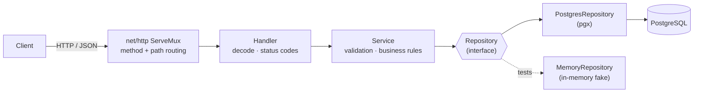

# Listings API

A small REST API for a second-hand marketplace, written in Go. Items have a
**condition** and a **trade-in value**, modelling the recommerce / trade-in flow
that platforms like Laku6 and Carousell run on.

Built deliberately on the standard library (Go's `net/http` routing) with a
clean handler → service → repository split, so the moving parts are easy to
follow. PostgreSQL for storage, fully Dockerized, with tests that run without a
database.

## Demo


## Architecture



Each layer has one job, and the service depends on the `Repository` interface
rather than Postgres directly. That seam is what lets the tests run the full
stack against an in-memory fake, with no database.

## Stack

- **Go 1.25+** - `net/http` ServeMux (method + path routing, `{id}` wildcards; introduced in Go 1.22), no web framework
- **PostgreSQL** via `pgx/v5` (connection pool)
- **Docker** + Docker Compose (multi-stage build, runs as non-root)
- **Testing** - standard `testing` + `net/http/httptest`, against an in-memory repository

## Run it

```bash
docker compose up --build
```

API on `http://localhost:8080`. Health check: `GET /healthz`.

Run the tests (no database needed):

```bash
docker compose run --rm api go test ./...   # or, with Go installed locally: go test ./...
```

## Endpoints

| Method | Path             | Purpose                                  |
|--------|------------------|------------------------------------------|
| POST   | `/listings`      | Create a listing                         |
| GET    | `/listings`      | List listings (`?status=`, `?category=`) |
| GET    | `/listings/{id}` | Get one listing                          |
| PATCH  | `/listings/{id}` | Partial update (e.g. reprice, mark sold) |
| DELETE | `/listings/{id}` | Delete a listing                         |

## Example

`price` and `trade_in_value` are whole rupiah (`int64`).

**Create a listing**

```bash
curl -s localhost:8080/listings -X POST -H 'Content-Type: application/json' -d '{
  "title": "iPhone 13 128GB",
  "description": "Minor scratches, battery 89%",
  "category": "smartphone",
  "condition": "good",
  "price": 7000000,
  "trade_in_value": 4500000
}'
```

```jsonc
// 201 Created
{
  "id": 1,
  "title": "iPhone 13 128GB",
  "description": "Minor scratches, battery 89%",
  "category": "smartphone",
  "condition": "good",
  "price": 7000000,
  "trade_in_value": 4500000,
  "status": "active",
  "created_at": "2026-06-01T09:30:00Z"
}
```

**List active smartphones**

```bash
curl -s 'localhost:8080/listings?status=active&category=smartphone'
```

```jsonc
// 200 OK
[
  { "id": 1, "title": "iPhone 13 128GB", "condition": "good", "price": 7000000,
    "trade_in_value": 4500000, "status": "active", "created_at": "2026-06-01T09:30:00Z" }
]
```

**Mark it sold** (partial update; only the fields you send change)

```bash
curl -s localhost:8080/listings/1 -X PATCH -H 'Content-Type: application/json' -d '{"status":"sold"}'
```

```jsonc
// 200 OK
{ "id": 1, "title": "iPhone 13 128GB", "status": "sold", "price": 7000000, "...": "..." }
```

**Validation rejects bad input**

```bash
curl -s localhost:8080/listings -X POST -H 'Content-Type: application/json' -d '{"condition":"mint","price":-5}'
```

```jsonc
// 400 Bad Request
{ "error": "title is required" }
```

## Design decisions (the "why")

- **Standard-library router.** Go 1.22's `ServeMux` does method + path matching
  and path wildcards, so a small REST API needs no third-party router. Fewer
  dependencies, nothing magic to explain.
- **Handler / service / repository split.** Handlers deal only with HTTP and
  JSON, the service holds business rules, the repository holds SQL. The service
  depends on a `Repository` *interface*, which is why the tests can run against
  an in-memory fake with no database.
- **Money as `int64`, never `float`.** Floating point cannot represent currency
  exactly; rounding drift is a real bug. Whole-rupiah integers avoid it.
- **Validation in two layers.** The Go layer rejects bad input early with clear
  messages; the database `CHECK` constraints are the last line of defence.
- **Parameterised SQL only.** Filters are built with `$N` placeholders, never by
  concatenating user input, so the queries are injection-safe.
- **Graceful shutdown.** On SIGINT/SIGTERM the server stops accepting new
  requests and drains in-flight ones before exiting.

## Limitations / what production would add

- A real migration tool (golang-migrate / goose) instead of the idempotent
  `EnsureSchema` bootstrap.
- Pagination on `GET /listings`, authentication, and request logging middleware.
- Optimistic concurrency on `PATCH` (the current read-modify-write has a
  last-writer-wins race under heavy concurrent edits of the same row).

## Work in progress

Good ways to go deeper in Go on top of this base:

1. Add a `min_price` / `max_price` filter to `GET /listings`.
2. Add a test for the active → sold transition via `PATCH`.
3. Add pagination (`?limit=&offset=`) to the list endpoint and its query.
4. Add request-logging middleware that records method, path, status, and latency.
